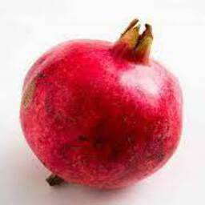
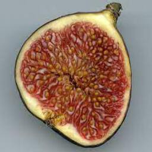
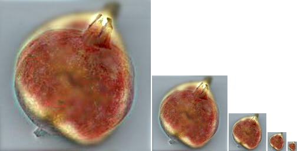

# Hybrid Images


A hybrid images has two coherent global image interpretations, one of which is of the low spatial frequencies, the other of high spatial frequencies. An example can be seen below:


 



## Usage


Code for generating hybird images:

e.g., for blending image 12 to image 13 use:

```

python hybrid.py -i0 ./data/12.jpeg -i1 ./data/13.jpeg

```


Use the mass_hybrid(config) function to generate the datase (please see the code).


This code is a modified version of the original code at:
https://github.com/rhthomas/hybrid-images


## Citation

If you use this code in your research, please cite this project.

```
@article{shapeDefense2020,
  title={Shape Defense},
  author={Borji, Al},
  journal={xx},
  year={2020}
}
```

